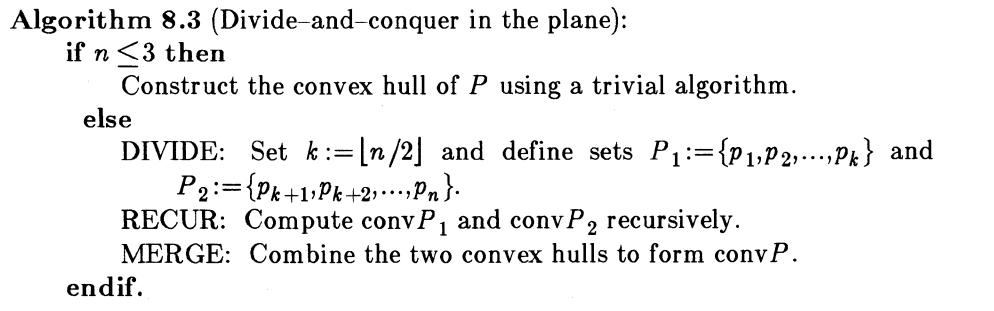
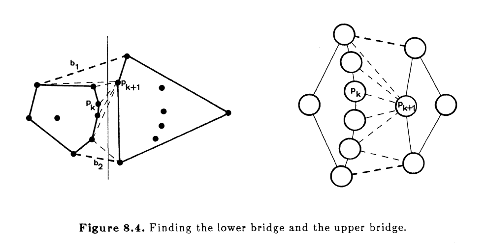

# Convex Hull

In geometry, the convex hull of a point set is the smallest convex set that contains it. Convex hulls find their application in various domains of engineering and sciences such as in collision detection and avoidance, Shape analysis, smallest enclosing box, etc.

As with sorting, there are many different approaches to solving the convex hull problem for a planar point set. 

## Requirements

It is required to write the convex hull algorithm which is based on the famous MergeSort sorting algorithm and which is detailed in Herbert Edelsbrunner’s book: “Algorithms in Combinatorial Geometry” (1987).

A simplified version of this algorithm assumes points ordered by x-coordinates (no vertically aligned points and no collinear points) and its pseudocode is described in the following figures.

Implement the MergeSort algorithm to order points.

